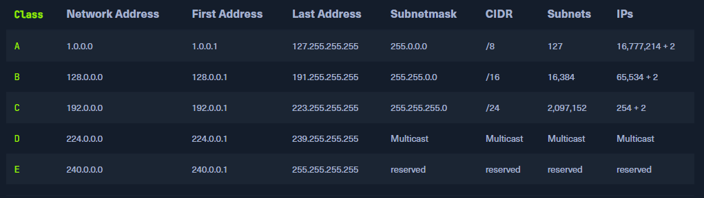

## [+] Network Layer
- Lớp mạng (Layer 3) của mô hình OSI kiểm soát việc trao đổi các gói dữ liệu, vì các gói này không thể được chuyển trực tiếp đến người nhận và do đó phải được cung cấp các nút định tuyến. Các gói dữ liệu sau đó được chuyển từ nút này sang nút khác cho đến khi chúng đến đích.
- Để thực hiện điều này, lớp mạng xác định các nút mạng riêng lẻ, thiết lập và xóa các kênh kết nối, và chịu trách nhiệm về định tuyến cũng như kiểm soát luồng dữ liệu.
-  Dựa trên các địa chỉ, việc định tuyến và xây dựng các bảng định tuyến được thực hiện.


**Nói tóm lại, nó chịu trách nhiệm cho các chức năng sau :**
- Định địa chỉ logic (Logical Addressing)
- Định tuyến (Routing)

.
Các giao thức được định nghĩa trong mỗi lớp của mô hình OSI, và các giao thức này đại diện cho một tập hợp các quy tắc cho việc truyền thông trong lớp tương ứng. Chúng không hiển thị đối với các giao thức của các lớp trên hoặc dưới. Một số giao thức thực hiện các nhiệm vụ của nhiều lớp và mở rộng qua hai hoặc nhiều lớp.

Các giao thức được sử dụng nhiều nhất trên lớp này là:
- IPv4 / IPv6
- IPsec
- ICMP
- IGMP
- RIP
- OSPF

> Các gói được chuyển tiếp không đến được các lớp cao hơn mà được chỉ định một đích trung gian mới và gửi đến nút tiếp theo.

## [+] IPv4 Addresses
Địa chỉ IP đảm bảo việc phân phối dữ liệu đến đúng người nhân. Chúng ta có thể hình dung địa chỉ IP với MAC như sau:
- IP địa chỉ Bưu điện đuy nhất và tòa nhà người nhận sinh sống.
- MAC địa chỉ tầng và phòng của người nhận trong căn hộ.


Cấu trúc IPv4: Gồm 4 block 8 bit 
| Notation | Presentation                            |
|----------|-----------------------------------------|
|  Binary  | 0111 1111.0000 0000.0000 0000.0000 0001 |
| Decimal  | 127.0.0.1                               |

Mối giao diện mạng (interface) được gán một địa chỉ duy nhất. Địa chỉ IPv4 được chia làm phần máy chủ (host) và phần mạng (network). Các khối mạng IP được chia thành các lớp A-E.

### 1. Subnet Mask
Subnet mask giúp phân tách mạng thành các mạng nhỏ hơn có độ dài bằng địa chỉ IPv4 mô tả thành phần mạng (bit 1) và máy chủ (bit 0)
```
Octet:             1st         2nd         3rd         4th
Binary:         1111 1111 . 1111 1111 . 1111 1111 . 0000 0000
Decimal:           255    .    255    .    255    .     0
```
### 2. Network and Gateway Addresses
- **Địa chỉ mạng (Network address)** và **Địa chỉ broadcast (Broadcast address)** có một vai trò khác là **Default gateway**, đây là tên gọi địa chỉ IPv4 của router kết vối mạng và hệ thống với các giao thức khác nhau, quản lí địa chỉ và phương truyền dẫn. 
- Thông thường, cổng mặc định được gán cho địa chỉ IPv4 đầu tiên hoặc cuối cùng có thể gán trong một subnet. Đây không phải là một yêu cầu kỹ thuật, nhưng đã trở thành một tiêu chuẩn thực tế trong các môi trường mạng có mọi quy mô.
- >**First address** and **Last Address**
### 3. Broadcast Address
- Địa chỉ IP broadcast có nhiệm vụ kết nối tất cả các thiết bị trong một mạng với nhau. Broadcast trong một mạng là một thông điệp được truyền đến tất cả các thành viên của mạng và không yêu cầu bất kỳ phản hồi nào.
-  Bằng cách này, một máy chủ gửi một gói dữ liệu đến tất cả các thành viên khác của mạng cùng một lúc và, qua đó, thông báo địa chỉ IP của nó, mà các thiết bị nhận có thể sử dụng để liên lạc với nó.
- > Địa chỉ IPv4 cuối cùng được sử dụng cho broadcast.
### 4. CIDR - Classless Inter-Domain Routing
Một phương pháp biểu diễn mạng con, cho biết bao nhiêu bit đầu tiên trong Subnet mask thuộc về mạng ( = 1)
```
    IPv4 Address: 192.168.10.39
    Subnet mask: 255.255.255.0
CDIR:
    CDIR: 192.168.10.39/24

IP Address
Octet:             1st         2nd         3rd         4th
Binary:         1111 1111 . 1111 1111 . 1111 1111 . 0000 0000 (/24)
Decimal:           255    .    255    .    255    .     0

```

## [+]  Subnetting
Việc chia một mạng IPv4 thành nhiều phạm vi địa chỉ nhỏ hơn goị là _subnetting_. Một mạng con là một đoạn logic của một mạng sử dụng các địa chỉ IP có cùng địa chỉ mạng. Cấu trúc một mạng con bao gồm:
- Dải địa chỉ mạng con: Đại chỉ đại diện cho mạng con đó (.0)
- Số lượng địa chỉ có thể gán (Assignable Addresses)
- Địa chỉ Network (.1)
- Địa chỉ Broadcast: Đây là địa chỉ được sử dụng để gửi thông điệp đến tất cả các thiết bị trong mạng con.

EX: 
```
    IPv4 Address: 192.168.12.160
    Subnet Mask: 255.255.255.192
    CIDR: 192.168.12.160/26
```

Binary system
| Details of   |  1st Octet | 2nd Octet  |  3rd Octet |  4th Octet | Decimal           |
|:-------------|:-----------|:-----------|:-----------|:-----------|:-------------------|
| IPv4        | **1100 0000** | **1010 1000** | **0000 1100** | **10**10 0000 | 192.168.12.160/26 |
| Subnet mask | **1111 1111** | **1111 1111** | **1111 1111** | **11**00 0000 | 255.255.255.192   |


Trong việc chia mạng con (subnetting), chúng ta sử dụng mặt nạ mạng con (subnet mask) như một mẫu cho địa chỉ IPv4. Từ các bit 1 trong mặt nạ mạng con, chúng ta biết được những bit nào trong địa chỉ IPv4 không thể thay đổi. Những bit này là cố định và do đó xác định "mạng chính" mà mạng con nằm trong đó.
- Bit 1 trong subnet mask: Những bit này đại diện cho phần của địa chỉ IPv4 thuộc về mạng chính và không thể thay đổi.
- Bit 0 trong subnet mask: Những bit này đại diện cho phần của địa chỉ có thể thay đổi để tạo ra các địa chỉ IP riêng lẻ trong mạng con.


Các bit trong phần host (.0) có thể được thay đổi để tạo ra địa chỉ đầu tiên và địa chỉ cuối cùng. Địa chỉ đầu tiên là địa chỉ mạng, và địa chỉ cuối cùng là địa chỉ broadcast cho mạng con tương ứng.
- Nếu địa chỉ nguồn và đích cùng trong một dải mạng con thì gói tin sẽ được truyền trong cùng một mạng con.
- Ngược lại gói tin sẽ phải truyền qua một mạng con khác thông qua **Deafault gateway**.

### 1. Network Address
| Details of  | 1st Octet | 2nd Octet | 3rd Octet | 4th Octet   | Decimal           |
|-------------|-----------|-----------|-----------|-------------|-------------------|
| IPv4        | 1100 0000 | 1010 1000 | 0000 1100 | 10\|**00 0000** | 192.168.12.128/26 |
| Subnet mask | 1111 1111 | 1111 1111 | 1111 1111 | 11\|**00 0000** | 255.255.255.192   |

### 2. Broadcast Address
| Details of  | 1st Octet | 2nd Octet | 3rd Octet | 4th Octet   | Decimal           |
|-------------|-----------|-----------|-----------|-------------|-------------------|
| IPv4        | 1100 0000 | 1010 1000 | 0000 1100 | 10\|**11 1111** | 192.168.12.191/26 |
| Subnet mask | 1111 1111 | 1111 1111 | 1111 1111 | 11\|**00 0000** | 255.255.255.192   |

```
Hosts	                IPv4
Network Address	        192.168.12.128
First Host	        192.168.12.129
Other Hosts	        ...
Last Host	        192.168.12.190
Broadcast Address	192.168.12.191
```

### 3. Example
```
Subnet: 192.168.12.128/26
Required Subnets: 4
```
- Số bit 0 trong host = 6. Số mạng con 4 = 2(bit) ^ 2(0 or 1). Sử dụng 2 bit để chia mạng con.
- Số bit 1 = 26 + 2 = 28 bits.

| Details of  | 1st Octet | 2nd Octet | 3rd Octet | 4th Octet   | Decimal           |
|-------------|-----------|-----------|-----------|-------------|-------------------|
| IPv4        | 1100 0000 | 1010 1000 | 0000 1100 | 1000\| 0000 | 192.168.12.128/28 |
| Subnet mask | 1111 1111 | 1111 1111 | 1111 1111 | 1111\| 0000 | 255.255.255.240   |

- Kích thước dải mạng con còn lại bằng 2 ^ số bits 0 = 2 ^ 4 = 64 (IPs)

| Subnet No. | Network Address | First Host     | Last Host      | Broadcast Address | CIDR              |
|------------|-----------------|----------------|----------------|-------------------|-------------------|
| 1          | 192.168.12.128  | 192.168.12.129 | 192.168.12.142 | 192.168.12.143    | 192.168.12.128/28 |
| 2          | 192.168.12.144  | 192.168.12.145 | 192.168.12.158 | 192.168.12.159    | 192.168.12.144/28 |
| 3          | 192.168.12.160  | 192.168.12.161 | 192.168.12.174 | 192.168.12.175    | 192.168.12.160/28 |
| 4          | 192.168.12.176  | 192.168.12.177 | 192.168.12.190 | 192.168.12.191    | 192.168.12.176/28 |


## [+] Mac Address
Mỗi máy chủ sở hữu 48 (6 x 8 bits) **Media Access Control (MAC) address**. Địa chỉ MAC là địa chỉ vật lý cho _Giao diện mạng_. Có một số tiêu chuẩn khác nhau cho địa chỉ MAC:
- Ethernet (IEEE 802.3)
- Bluetooth (IEEE 802.15)
- WLAN (IEEE 802.11) 


Mỗi dao diện kết nối có một địa chỉ MAC duy nhất được đánh dấu bởi nahf sản xuất, nhưng có thể thay đổi được, ít nhất là tạm thời. EX:
```
    DE:AD:BE:EF:13:37
    DE-AD-BE-EF-13-37
    DEAD.BEEF.1337
```

| Representation | 1st Octet | 2nd Octet | 3rd Octet | 4th Octet | 5th Octet | 6th Octet |
|----------------|-----------|-----------|-----------|-----------|-----------|-----------|
| Binary         | 1101 1110 | 1010 1101 | 1011 1110 | 1110 1111 | 0001 0011 | 0011 0111 |
| Hex            | DE        | AD        | BE        | EF        | 13        | 37        |


- Địa chỉ MAC bao gồm tổng cộng 6 byte. Nửa đầu tiên (3 byte / 24 bit đầu tiên) được gọi là Identifier Độc Quyền Tổ Chức (OUI) được định nghĩa bởi Viện Kỹ thuật Điện và Điện tử (IEEE) cho các nhà sản xuất tương ứng.
- Nửa cuối của địa chỉ MAC được gọi là Phần Địa chỉ Cá nhân hoặc Bộ điều khiển Giao diện Mạng (NIC), được các nhà sản xuất gán. Nhà sản xuất chỉ đặt chuỗi bit này một lần duy nhất và do đó đảm bảo rằng địa chỉ hoàn chỉnh là duy nhất.
- Nếu người gửi và người nhận đều nằm trong cùng 1 mạng con thì việc gửi gói tin sẽ được thực hiện ngay lập tức.
- Ngược lại, Khung Ethernet được địa chỉ hóa tới địa chỉ MAC của bộ định tuyến có trách nhiệm (cổng mặc định). Nếu địa chỉ đích của khung Ethernet khớp với địa chỉ layer 2 của HOSTs, bộ định tuyến sẽ chuyển tiếp khung đến các tầng cao hơn.
- Giao thức **Address Resolution Protocol (ARP)** được sử dụng trong IPv4 để xác định các địa chỉ MAC liên kết với các địa chỉ IP.

### 1. Unicast and Multicast
Hai bit cuối của 1st Octet đóng vai trò quan trọng khác. 
| Representation | 1st Octet | 2nd Octet | 3rd Octet | 4th Octet | 5th Octet | 6th Octet |
|----------------|-----------|-----------|-----------|-----------|-----------|-----------|
| Binary         | 1101 1110 | 1010 1101 | 1011 1110 | 1110 1111 | 0001 0011 | 0011 0111 |
| Hex            | DE        | AD        | BE        | EF        | 13        | 37        |

Bit cuối cùng có thể là **0 (Unicast)** và **1 (Multicast)**.
- **Unicast :** Mỗi gói tin được gửi sẽ tới một địa chỉ duy nhất.
- **Multicast :** Gói tin được gửi 1 lần tới tất cả các máy chủ và máy chủ sẽ quyết định nhận hay không gói tin đấy. Địa chỉ Multicast là địa chỉ duy nhất, có các giá trị octet cố định. Nó chủ yếu được sử dụng nếu địa chỉ của người nhận gói tin chưa được biết đến. Một ví dụ là các giao thức ARP (cho địa chỉ MAC) và DHCP (cho địa chỉ IPv4).


Bit cuối thứ 2 có thể là **0 (Global OUI)** được xác định bởi IEEE hay **1 (Locally Administrated)**  được quản lý cục bộ.

### 2. Address Resolution Protocol
Các địa chỉ MAC có thể được thay đổi / can thiệp hoặc giả mạo, và do đó, chúng không nên được phụ thuộc một mình như một phương tiện bảo mật hoặc nhận dạng độc lập. Quản trị mạng nên triển khai các biện pháp bảo mật bổ sung, như phân đoạn mạng và các giao thức xác thực mạnh mẽ, để bảo vệ chống lại các cuộc tấn công tiềm ẩn: 
- **MAC spoofing** (Giả mạo MAC): Điều này liên quan đến thay đổi địa chỉ MAC của một thiết bị để khớp với một thiết bị khác, thường là để truy cập vào mạng một cách trái phép.

- **MAC flooding** (Tràn địa chỉ MAC): Điều này liên quan đến việc gửi nhiều gói tin với các địa chỉ MAC khác nhau đến một bộ chuyển mạch mạng, làm cho nó đạt đến dung lượng bảng địa chỉ MAC của nó và hiệu quả làm cho nó không thể hoạt động đúng cách.

- **MAC address filtering** (Lọc địa chỉ MAC): Một số mạng có thể được cấu hình chỉ cho phép truy cập cho các thiết bị có địa chỉ MAC cụ thể mà chúng có thể tiềm ẩn bằng cách cố gắng truy cập vào mạng bằng cách sử dụng một địa chỉ MAC giả mạo.

### 3. Address Resolution Protocol
- Phân giải địa chỉ giao thức (ARP) là một giao thức mạng. Đó là một phần quan trọng của giao tiếp mạng được sử dụng để giải quyết một địa chỉ IP tầng mạng (tầng 3) thành một địa chỉ MAC tầng liên kết (tầng 2). Nó ánh xạ địa chỉ IP của một máy chủ thành địa chỉ MAC tương ứng để tạo điều kiện cho việc giao tiếp giữa các thiết bị trên Mạng Cục bộ (LAN).

- Khi một thiết bị trên một LAN muốn giao tiếp với một thiết bị khác, nó gửi một thông điệp phát sóng chứa địa chỉ IP đích và địa chỉ MAC của chính nó. Thiết bị có địa chỉ IP khớp sẽ phản hồi bằng địa chỉ MAC của chính nó, và hai thiết bị sau đó có thể giao tiếp trực tiếp bằng cách sử dụng địa chỉ MAC của họ. Quá trình này được gọi là giải quyết ARP.

- ARP là một phần quan trọng của quá trình giao tiếp mạng vì nó cho phép các thiết bị gửi và nhận dữ liệu bằng cách sử dụng địa chỉ MAC thay vì địa chỉ IP, điều này có thể hiệu quả hơn. Có hai loại thông điệp yêu cầu có thể được sử dụng: **ARP Request** và **ARP Reply**

- **ARP Request**: Người gửi sẽ gửi 1 yêu cầu ARP gồm IP đích và MAC của người gửi. Người nhận có IP trùng với IP người gửi yêu cầu sẽ phản hồi lại với địa chỉ MAC của người gửi.
- **ARP Reply**: Khi một thiết bị nhận được một yêu cầu ARP, nó gửi một phản hồi ARP đến thiết bị yêu cầu với địa chỉ MAC của nó. Tin nhắn phản hồi chứa địa chỉ IP và MAC của cả hai thiết bị yêu cầu và thiết bị phản hồi.

## [+] IPv6 Address
IPv6 là một sự cải tiến của IPv4. Trong khi IPv4 chỉ có 32 bit thì IPv6 có đến 128bit. Vì thế số lượng IPs được cấp sẽ rất lớn khó có thể bị trùng. Tuy nhiên theo quy tắc IPv4 và IPv6 sẽ được cung cấp đồng thời (Dual Stack).


IPv6 tuân thủ theo quy tắc end-to-end và cung cấp địa chỉ IP có thể truy cập công cộng cho bất kỳ thiết bị kết thúc nào mà không cần NAT. 

> Do đó, một giao diện có thể có nhiều địa chỉ IPv6, và có các địa chỉ IPv6 đặc biệt mà nhiều giao diện được gán vào.

IPv6 là giao thức có nhiều tính năng mới và cũng có nhiều ưu điểm khác so với IPv4:
```
- Không gian địa chỉ lớn hơn
- Địa chỉ tự cấu hình (Address self-configuration (SLAAC))
- Nhiều địa chỉ cho cùng 1 giao diện kết nối 
- Định tuyến nhanh hơn
- End-to-end encryption (IPsec)
- Gói dữ liệu lên tới 4 GByte
```

Có 4 loại địa chỉ IPv6:
| Type      | Description                                                          |
|-----------|----------------------------------------------------------------------|
| Unicast   | Địa chỉ cho một giao diện                                            |
| Anycast   | Địa chỉ cho nhiều giao diện nhưng chỉ nhận 1 trong số các giao diện. |
| Multicast | Địa chỉ cho nhiều giao diện và nhận tất cả các giao diện             |
| Broadcast | Không tồn tại và thực hiện bằng địa chỉ Multicast                    |


Tổng cộng, địa chỉ IPv6 bao gồm 16 byte. Do độ dài của nó, một địa chỉ IPv6 được biểu diễn dưới dạng hexa. Do đó, 128 bit được chia thành 8 khối nhân với 16 bit (hoặc 4 số hex). Tất cả bốn số hex được nhóm và phân tách bằng một dấu hai chấm ( : ) thay vì một dấu chấm đơn ( . ) như trong IPv4. Để đơn giản hóa việc biểu diễn, chúng ta bỏ qua ít nhất 4 số 0 đầu tiên trong các khối, và chúng ta có thể thay thế chúng bằng hai dấu hai chấm ( :: ). EX:
```
Full IPv6: fe80:0000:0000:0000:dd80:b1a9:6687:2d3b/64
Short IPv6: fe80::dd80:b1a9:6687:2d3b/64
```

Địa chit IPv6 được chia làm 2 phần:
- **Network Prefix (network part) :** Xác định mạng, subnet hoặc phạm vi địa chỉ
- **Interface Identifier hay Suffix (host part) :** Được hình thành từ 48 bits địa chỉ MAC, và được chuyển đổi thành một địa chỉ 64 bit trong quá trình đó. Độ dài tiền tố mặc định là /64. Tuy nhiên, các tiền tố phổ biến khác là /32, /48 và /56. Nếu chúng ta muốn sử dụng các mạng của mình, chúng ta sẽ nhận được một tiền tố ngắn hơn (ví dụ: /56) so với /64 từ nhà cung cấp của chúng ta.


