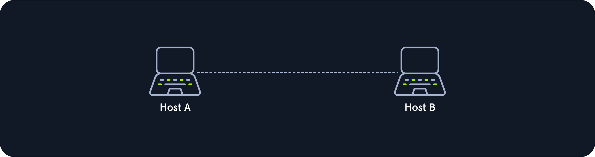
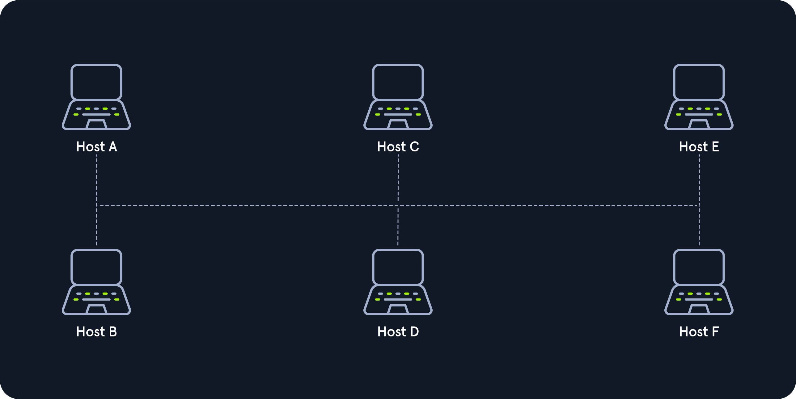
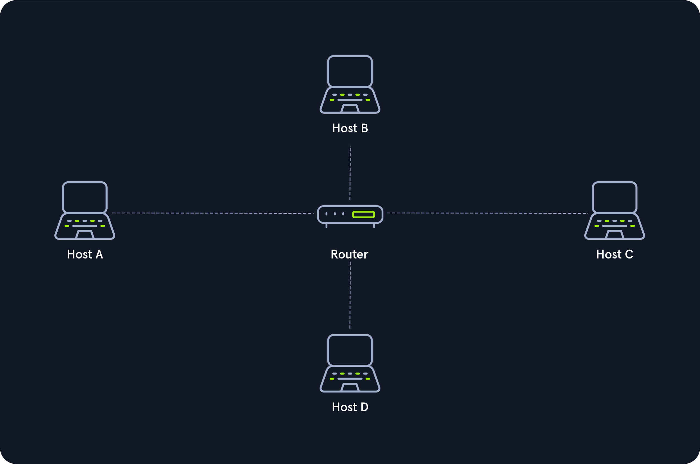
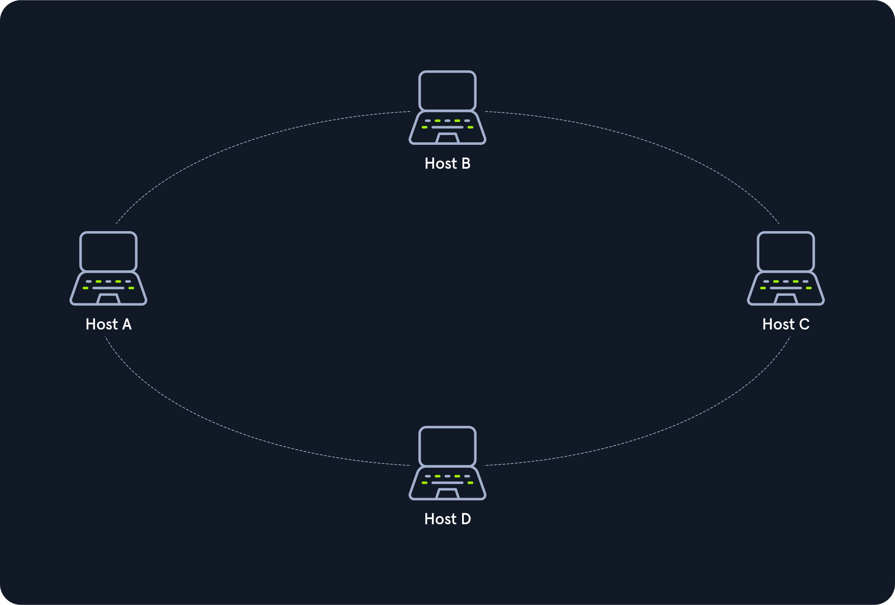
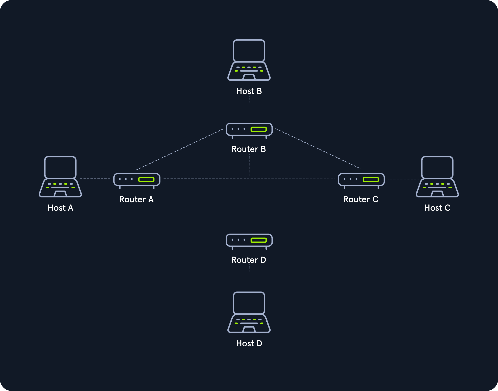
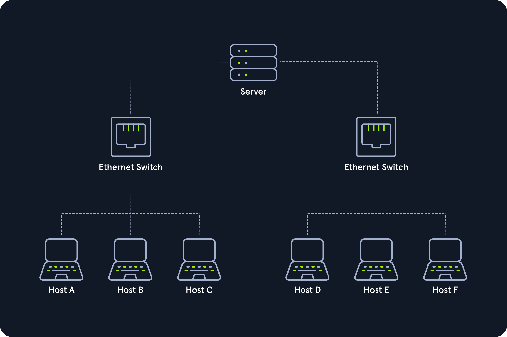
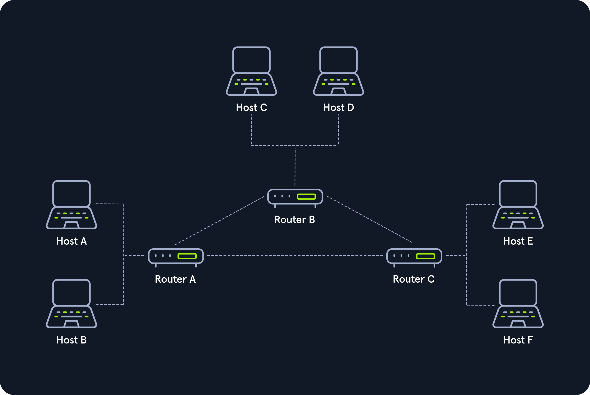
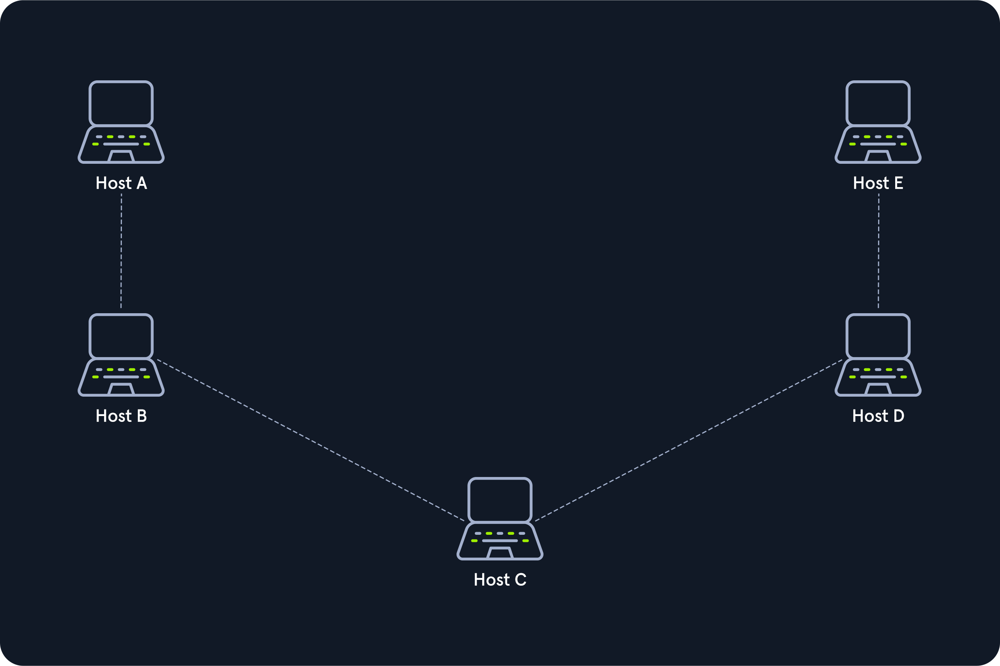
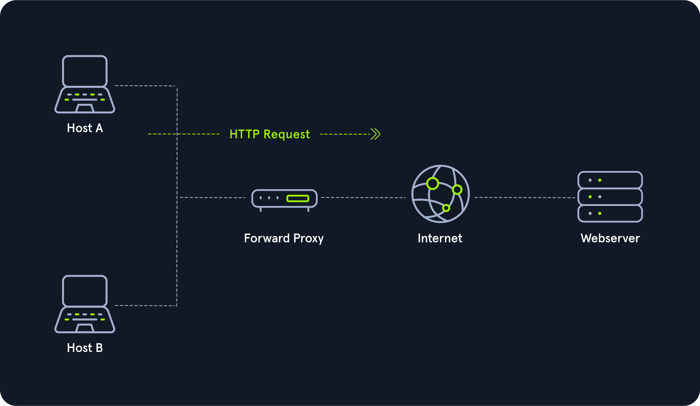
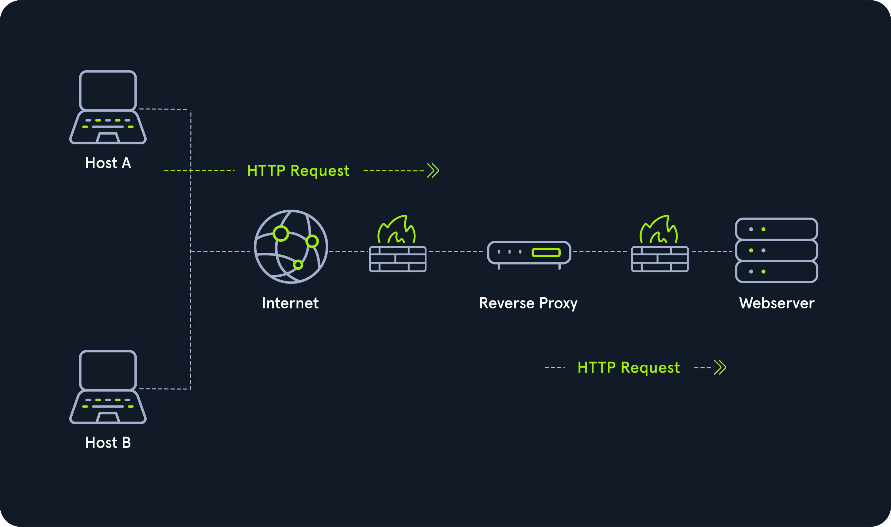

### Overview
* Mỗi mạng được cấu trúc khác nhau và được thiết lập riêng lẻ. Phân biệt các loại mạng dựa trên "_types_"  và "_topologies_". Một số thuật ngữ thông dụng:
    - Wide Area Network (WAN)
    - Local Area Network (LAN)
    - Wireless Local Area Network (WLAN)
    - Virtual Private Network (VPN)
* Network topologies là sự sắp xếp điển hình kết nối vật lí hay logic của các thiết bị trong mạng. Cấu trúc liên kết vật lý của mạng là phương tiệng truyền dẫn kết nối các thiết bị trong mạng (như dây cáp mạng,...), điều này liên quan đến sơ đồ cáp, vị trí các nút mang. Cấu trúc liên kết logic là cách tín hiệu hoạt động trên phương tiện mạng - cách các dữ liệu hoặc gói tin được truyền đi.
---
## [+] Network Types
### 1.WAN
Hay quen thuộc hơn là **The Internet**. Địa chỉ mạng WAN được truy cập bởi Internet. WAN là số lượng lớn các mạng LAN nối với nhau. Nhiều cơ quan CHính phủ hoặc Công ty sẽ có mạng "WAN nội bộ" (còn được gọi là Intranet.). Có một số cách kiểm tra có phải mạng WAN hay khôgn như BGP hoặc _IP không nằm trong RFC 1918_ (10.0.0.0/8, 172.16.0.0/12, 192.168.0.0/16).


### 2.LAN and WLAN
EX: Internal Networks (Ex: Home or Office)

Mạng cục bộ và mạng cục bộ không dây. Thường sẽ được chỉ định để sử dụng cục bộ như RFC 1918, 10.0.0.0/8, 172.16.0.0/12, 192.168.0.0/16. WLAN sử dụng kết nối không dây trong khi LAN cần sử dụng cáp kết nối.

### 3.VPN
Có 3 loại VPN đều nhằm mục đích khiến người dùng cảm thấy như kết nối tới một mạng khác.
- Site-to-site VPN
- Remote Access VPN
- SSL VPN
.
## [+] Network Topologies
### 1. Kết nối
| Wired connections | Wireless connections |
|:-----------------:|:--------------------:|
| Cáp đồng trục     | Wifi                 |
| Sợi thủy tinh     | Di động (cellular)   |
| Cáp xoắn đôi      | Vệ tinh(satellite)   |
| Khác...           |                      |

### 2. Nodes -  Network Interface Controller (NICs)
Các nút mạng là điểm kết nối của phương tiện truyền dẫn. Một nút có thể được kết nối với máy tính, nhưng một số loại nhất định có thể chỉ có một bộ vi điều khiển trên một nút hoặc có thể không có thiết bị lập trình nào cả.
```
| Repeaters    | Hubs     | Bridges   | Switches |
| Router/Modem | Gateways | Firewalls |          |
```
### 3. Classifications
Chúng ta có thể hình dung cấu trúc liên kết như một dạng hoặc cấu trúc ảo của mạng. Hình thức này không nhất thiết phải tương ứng với sự sắp xếp vật lý thực tế của các thiết bị trong mạng. Do đó, các cấu trúc liên kết này có thể là vật lý hoặc logic. 

Cấu trúc liên kết mạng được chia thành 8 loại cơ bản sau:
- **Point-to-Point :** Một liên kết vật lí trực tiếp nối 2 máy chủ (HOSTs). 
{width:50% height:50%}
- **Bus :** Tất cả các máy chủ kết nối vào 1 đường truyền dẫn và không có thành phần trung tâm mạng kiểm soát.
{width:50% height:50%}
- **Star :** Một thành phần mạng duy trì tất cả các kết nối tới máy chủ. Mỗi máy chủ được kết nối với thành phần mạng trung tâm thông qua một liên kết riêng. Đây thường là bộ định tuyến, trung tâm hoặc bộ chuyển mạch. Lưu lượng dữ liệu trên thành phần mạng trung tâm có thể rất cao vì tất cả dữ liệu và kết nối đều đi qua nó.
{width:50% height:50%}
- **Ring :** Mỗi máy chủ hoặc nút được liên kết tới vòng bằng 2 sợi cáp:
    - Một cho tín hiệu đến
    - Một dây kahcs cho tín hiệu đi.
    - Cấu trúc liên kết vòng thường không yêu cầu thành phần mạng hoạt động.
    - Cấu trúc liên kết vòng logic dựa trên cấu trúc liên kết hình sao vật lý, trong đó nhà phân phối tại nút mô phỏng vòng bằng cách chuyển tiếp từ cổng này sang cổng tiếp theo.
    - Thông tin được truyền theo hướng truyền được xác định trước.
{width:50% height:50%}
- **Mesh :** Các nút mạng được liên kết với nhau có thể chia sẻ lưu lượng truyền tải nếu một trong các nút bị hỏng.
{width:50% height:50%}
- **Tree :** Là cấu trúc Star mở rộng. 
{width:50% height:50%}
- **Hybrid :** Là sự kết hợp của 2 hay nhiều cấu trúc mạng khác nhau nhằm nhiều mục đích khác nhau.
{width:50% height:50%}
- **Daisy Chain :** Trong cấu trúc, nhiều máy chủ được kết nối bằng cách đặt cáp từ nút này sang nút khác. 
{width:50% height:50%}

## [+] Proxies
Procies hoạt động ở Layer & mô hình OSI bao gồm những dịch vị chính dưới đây:
- Dedicated Proxy / Forward Proxy
- Reverse Proxy
- Transparent Proxy
### 1. Dedicated Proxy / Forward Proxy
- Forward Proxy đại diện cho các máy clients. Nó đại diện cho clients gửi request tới các webserver, sau đó nó nhận dữ liệu mà các target site trả về và chuyển tới clients nếu hợp lệ.
- Forward Proxy lọc các yêu cầu được gửi đi.
{width:50% height:50%}

### 2. Reverse Proxy
- Ngược lại với Forward Proxy, Reverse Proxy lọc các yêu cầu được gửi đến. Mục tiêu của Reverse Proxy là lắng nghe 1 địa chỉ và chuyển tiếp nó đến mạng đóng.
- Nhiều tổ chức sử dụng CloudFlare vì họ có mạng mạnh mẽ có thể chống lại hầu hết các cuộc tấn công DDOS. Bằng cách sử dụng Cloudflare, các tổ chức có cách lọc số lượng (và loại) lưu lượng truy cập được gửi đến máy chủ web của họ.
- Một Reverse Proxy phổ biến là ModSecurity, một Web Application Firewall (WAF). Tường lửa ứng dụng web kiểm tra các yêu cầu web để tìm nội dung độc hại và chặn yêu cầu đó nếu nó độc hại.
{width:50% height:50%}

### 3. Transparent Proxy
Proxy hoạt động minh bạch hoặc không minh bạch.
- Các proxy minh bạch thì client không biết về nó. Proxy minh bạch chặn các yêu cầu liên lạc của khách hàng với Internet và hoạt động như một phiên bản thay thế. Nhìn từ bên ngoài, proxy minh bạch, giống như proxy không minh bạch, hoạt động như một đối tác liên lạc.

- Nếu đó là Proxy không minh bạch, chúng tôi phải được thông báo về sự tồn tại của nó. Vì mục đích này, chúng tôi và phần mềm chúng tôi muốn sử dụng được cung cấp một cấu hình proxy đặc biệt để đảm bảo rằng lưu lượng truy cập Internet trước tiên được gửi đến proxy. Nếu cấu hình này không tồn tại, chúng tôi không thể liên lạc qua proxy.
Tuy nhiên, do proxy thường cung cấp đường dẫn liên lạc duy nhất đến các mạng khác nên việc liên lạc với Internet thường bị cắt nếu không có cấu hình proxy tương ứng.


