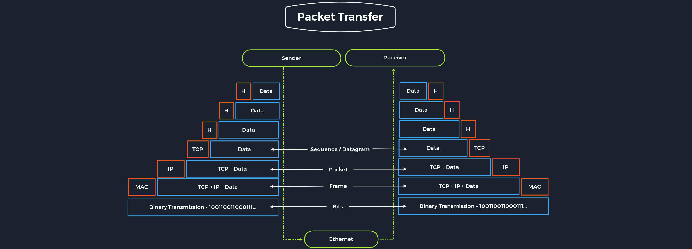

### Overview

---

## [+] Networking Models
Có 2 mô hình mạng mô tả việc giao tiếp và truyền dữ liệu giữa 2 máy chủ (HOSTs) là mô hình **OSI** và mô hình **TCP/IP**
- 
- **TCP/IP**  đề cập đến Transmission Control Protocol được sử dụng bởi các ứng dụng trên Internets. Ngược lại, **OSI** nó cho phép giảm nhẹ các quy tắc phải tuân theo, miễn là tuân theo các nguyên tắc chung.
- Trong hệ thống phân lớp, các thiết bị trong lớp trao đổi dữ liệu ở định dạng khác gọi là đơn vị dữ liệu giao thức **(Protocol data unit- PDU)**
- 
- Trong quá trình truyền, mỗi lớp thêm một tiêu đề vào PDU từ lớp trên, tiêu đề này kiểm soát và nhận dạng gói. Quá trình này được gọi là đóng gói (**encapsulation**).
- Tiêu đề và dữ liệu cùng nhau tạo thành PDU cho lớp tiếp theo. Quá trình tiếp tục đến Lớp vật lý hoặc Lớp mạng, nơi dữ liệu được truyền đến người nhận.
- Người nhận đảo ngược quá trình và giải nén dữ liệu trên mỗi lớp với thông tin tiêu đề. Sau đó, ứng dụng cuối cùng cũng sử dụng được dữ liệu. Quá trình này tiếp tục cho đến khi tất cả dữ liệu được gửi và nhận.

## [+] OSI Models
- Mô hình OSI, thường được gọi là mô hình lớp ISO/OSI, là mô hình tham chiếu có thể được sử dụng để mô tả và xác định giao tiếp giữa các hệ thống. Mô hình tham chiếu có bảy lớp riêng lẻ, mỗi lớp có nhiệm vụ được phân tách rõ ràng.
- Thuật ngữ OSI là viết tắt của mô hình Open Systems Interconnection

| Layer          | Function                                                                                                                                                           |
|----------------|--------------------------------------------------------------------------------------------------------------------------------------------------------------------|
| 7.Application  | Kiểm soát đầu vào và đầu ra của dữ liệu và cung cấp các chức năng của ứng dụng.                                                                                    |
| 6.Presentation | Nhiệm vụ của lớp trình bày là chuyển việc trình bày dữ liệu phụ thuộc vào hệ thống sang một dạng độc lập với ứng dụng.                                             |
| 5.Session      | Lớp session kiểm soát kết nối logic giữa hai hệ thống và ngăn ngừa, chẳng hạn như sự cố kết nối hoặc các sự cố khác.                                               |
| 4.Transport    | Lớp 4 được sử dụng để kiểm soát dữ liệu được truyền từ đầu đến cuối. Lớp vận chuyển có thể phát hiện và tránh các tình huống tắc nghẽn và phân đoạn luồng dữ liệu. |
| 3.Network      | Các kết nối được thiết lập trong mạng chuyển mạch kênh và các gói dữ liệu được chuyển tiếp trong mạng chuyển mạch gói.                                             |
| 2.Data Link    | Cho phép truyền các tin tin cậy và không có lỗi trong môi trường tương ứng. Dòng bit dữ liệu ở lớp 1 sẽ được chi thành các frame và                                |
| 1.Physical     | Việc truyền tải dữ liệu diễn ra trên đường truyền có dây hoặc không dây.                                                                                           |

- Lớp 2-4 Định hướng vận chuyển trong khi các lớp 5-7 Định hướng ứng dụng. Trong mỗi lớp, các nhiệm vụ được xác định chính xác sẽ được thực hiện và giao diện với các lớp lân cận được mô tả chính xác.
- Mỗi lớp cung cấp các dịch vụ để sử dụng cho lớp ngay phía trên nó.
- Nếu hai hệ thống giao tiếp với nhau, tất cả bảy lớp của mô hình OSI sẽ được chạy qua ít nhất hai lần, vì cả người gửi và người nhận đều phải tính đến mô hình lớp. Do đó, một số lượng lớn các nhiệm vụ khác nhau phải được thực hiện trong các lớp riêng lẻ để đảm bảo tính bảo mật, độ tin cậy và hiệu suất của truyền thông.
> Khi một ứng dụng gửi một gói đến hệ thống khác, hệ thống sẽ xử lý các lớp được hiển thị ở trên từ lớp 7 xuống lớp 1 và hệ thống nhận sẽ giải nén gói nhận được từ lớp 1 lên lớp 7. 

## [+] TCP/IP Models
TCP/IP (Transmission Control Protocol/Internet Protocol) là thuật ngữ chung cho nhiều giao thức mạng. Các giao thức chịu trách nhiệm chuyển đổi, đóng gói, vận chuyển các dữ liệu trên Internet. Internet hoàn toàn dựa trên họ giao thức TCP/IP. Tuy nhiên, TCP/IP không chỉ đề cập đến hai giao thức này mà còn thường được sử dụng như một thuật ngữ chung cho toàn bộ họ giao thức.

- Thuật ngữ TCP/IP là viết tắt của hai giao thức Giao thức điều khiển truyền (**Transmission Control Protocol - TCP**) và Giao thức Internet (**Internet Protocol - IP**). IP nằm trong lớp mạng (Lớp 3) và TCP nằm trong lớp vận chuyển (Lớp 4) của mô hình lớp OSI.
- IP đảm bảo gói dữ liệu truyền đến đúng đích và TCP kiểm soát việc truyền dữ liệu và đảm bảo kết nối giữa luòng dữ liệu và ứng dụng.

| Layer         | Function                                                                                                                                                                                                                   |
|---------------|----------------------------------------------------------------------------------------------------------------------------------------------------------------------------------------------------------------------------|
| 4.Application | Lớp App cho phép các ứng dụng truy cập các dịch vụ của các lớp khác và xác định các giao thức mà ứng dụng sử dụng để trao đổi dữ liệu.                                                                                     |
| 3.Transport   | Lớp Transport chịu trách nhiệm cung cấp các dịch vụ gói dữ liệu phiên (TCP) và (UDP) cho Lớp ứng dụng.                                                                                                                     |
| 2.Internet    | Lớp Internet chịu trách nhiệm về các chức năng định địa chỉ, đóng gói và định tuyến máy chủ. (IP)                                                                                                                          |
| 1.Link        | Lớp Link chịu trách nhiệm đặt các gói TCP/IP trên phương tiện mạng và nhận các gói tương ứng từ phương tiện mạng. TCP/IP được thiết kế để **hoạt động độc lập với phương thức truy cập mạng, định dạng khung và phương tiện.** |

**Nhiệm vụ quan trọng nhất của TCP/IP là :**
### 1. Logical Addressing - IP
- Có nhiều máy chủ trong các mạng khác nhau, nên cần phải cấu trúc lại các thành phần mạng và địa chỉ Logic. IP được đánh dấu địa chỉ cho các mạng và các nút mạng. 
- Các gói dữ liệu chỉ đến được mạng nơi chúng cần đến. Các phương pháp để thực hiện điều này bao gồm các lớp mạng, chia subnet, và CIDR.
### 2. Routing - IP
- Đối với mỗi gói dữ liệu, nút tiếp theo được xác định tại mỗi nút trên đường từ người gửi đến người nhận. Bằng cách này, một gói dữ liệu được định tuyến đến người nhận của nó, ngay cả khi vị trí của người nhận không được biết đến bởi người gửi.
### 3. Error & Control Flow - TCP
- Người gửi và người nhận thường xuyên liên lạc với nhau thông qua kết nối ảo. Do đó, các thông báo điều khiển được gửi liên tục để kiểm tra xem kết nối có còn được thiết lập hay không. (**SYN-ACK**)
### 4. Application Support - TCP
- Các cổng TCP và UDP tạo thành một phần mềm trừu tượng để phân biệt các ứng dụng cụ thể và các liên kết truyền thông của chúng.

EX: TCP for mail or website - UDP for video,...

### 5. Name Resolution - TCP
- DNS cung cấp độ phân giải tên thông qua Tên miền đủ điều kiện (FQDN) trong địa chỉ IP, cho phép chúng tôi tiếp cận máy chủ mong muốn bằng tên được chỉ định trên internet.

